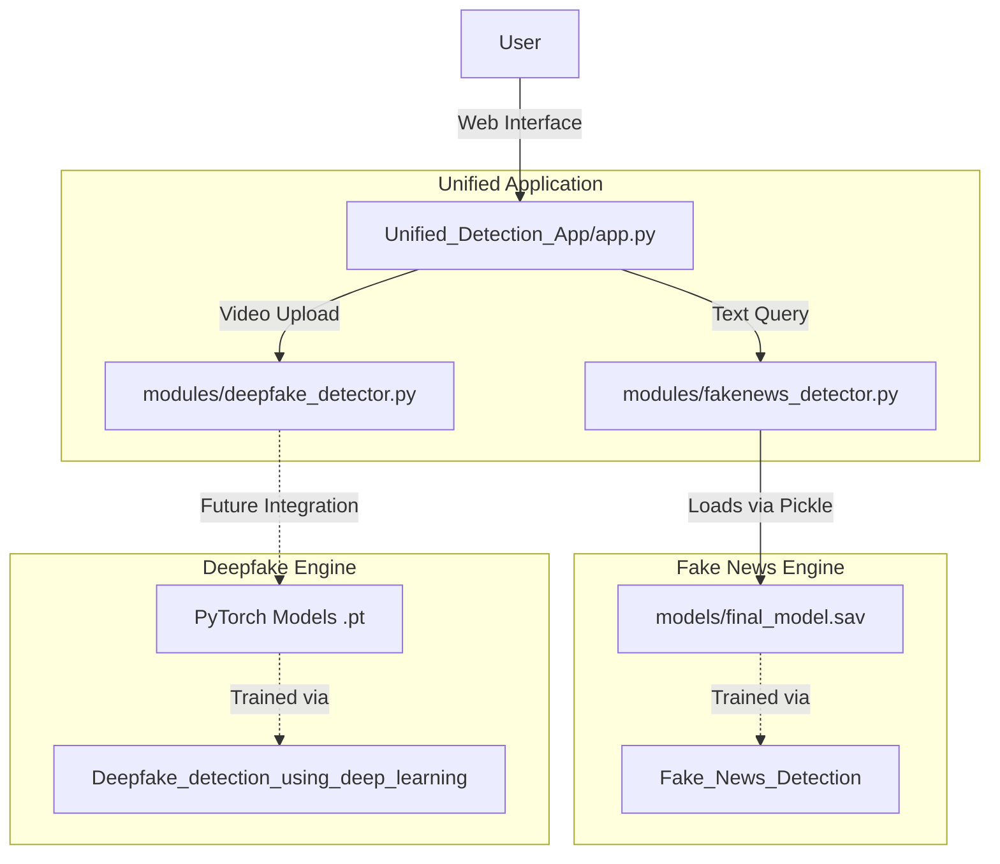

# Codebase Architecture Context

## Overview
The repository contains three major components that build towards a unified detection platform for Fake News and Deepfake videos. The architecture consists of two standalone machine learning projects and one unified web application that integrates their capabilities.

## 1. Deepfake Detection (`Deepfake_detection_using_deep_learning`)
This module provides a deep learning-based approach to detect deepfake videos using an ensembled architecture of a pre-trained ResNext CNN and an LSTM network.
- **Purpose**: Train and deploy models to classify videos as real or deepfake.
- **Key Sub-directories**:
  - `Model Creation`: Contains the logic for dataset preparation, feature extraction, and PyTorch model training.
  - `Django Application/ml_app`: A Django application that serves the deepfake model. It processes uploaded videos, extracts frames using OpenCV, detects faces using `face_recognition`, and runs the PyTorch model for predictions.
- **Dependencies**: Django, PyTorch (`torch`, `torchvision`), OpenCV (`cv2`), `face_recognition`, `numpy`, `matplotlib`.
- **Entry Points**: `Django Application/manage.py`.

## 2. Fake News Detection (`Fake_News_Detection`)
This module provides natural language processing text classification models (e.g., Logistic Regression, Passive Aggressive Classifier) trained on the LIAR dataset to detect fake news.
- **Purpose**: Train and deploy models to classify text as authentic or fake news.
- **Key Modules**:
  - `DataPrep.py` / `FeatureSelection.py`: Data preprocessing (tokenization, stemming, stop words) and TF-IDF vectorization.
  - `classifier.py`: Script to train various classifiers with scikit-learn.
  - `prediction.py`: CLI tool to predict news authenticity using a serialized model (`final_model.sav`).
  - `front.py`: A simple standalone Flask web UI for querying fake news text.
- **Dependencies**: `scikit-learn`, `nltk`, `pandas`, `numpy`, `Flask`.
- **Entry Points**: `front.py` (Web UI), `prediction.py` (CLI script).

## 3. Unified Detection App (`Unified_Detection_App`)
This is the primary user-facing application that integrates the functionalities of the two standalone projects into a single, modern web interface.
- **Purpose**: A comprehensive web application featuring a glassmorphism UI to analyze both text and video.
- **Key Modules**:
  - `app.py`: The main Flask server defining routes and API endpoints for both text and video detection.
  - `modules/fakenews_detector.py`: A wrapper class that loads the serialized `final_model.sav` from the `Fake_News_Detection` project using `pickle`, and preprocesses input text via NLTK before feeding it into the scikit-learn pipeline.
  - `modules/deepfake_detector.py`: A wrapper class to manage video processing. *Note*: Currently, it implements dummy logic (a heuristic-based placeholder) for deepfake detection. It is designed to be upgraded by integrating the PyTorch models from the `Deepfake_detection_using_deep_learning` module.
  - `config.py`: Application configurations (e.g., model paths, upload limits).
- **Dependencies**: `Flask`, `scikit-learn`, `nltk`, `opencv-python`, `werkzeug`.
- **Entry Points**: `app.py`.

## Architecture Diagram & Flow

## Summary
The system is transitioning towards the **Unified Detection App**. Currently, the Fake News detection is fully integrated using the pre-trained Scikit-learn models. The Deepfake Detection is actively functional in its standalone Django app but requires PyTorch/model integration within the `modules/deepfake_detector.py` to be fully operational in the unified Flask platform.
